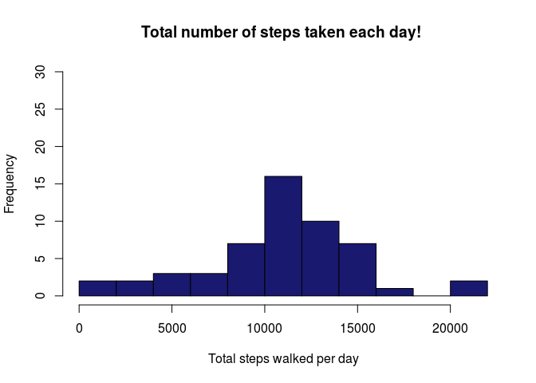
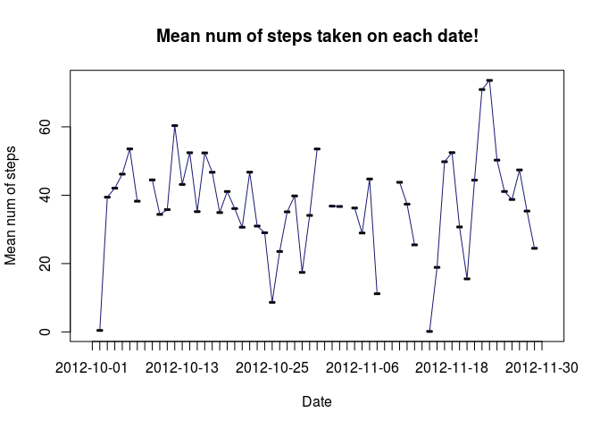
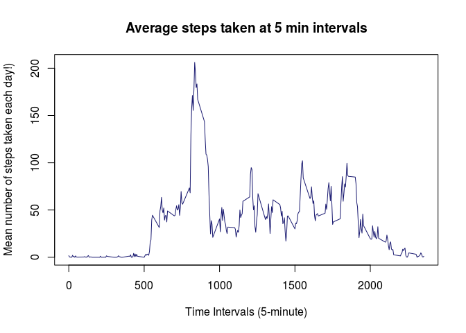
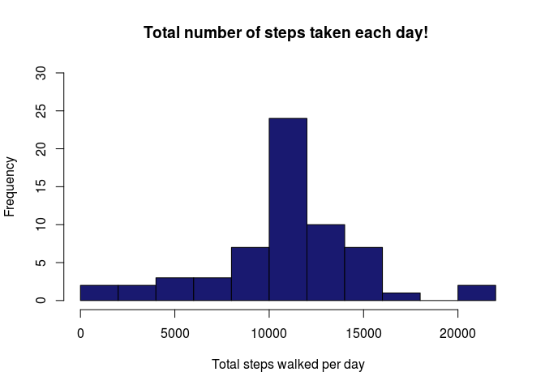
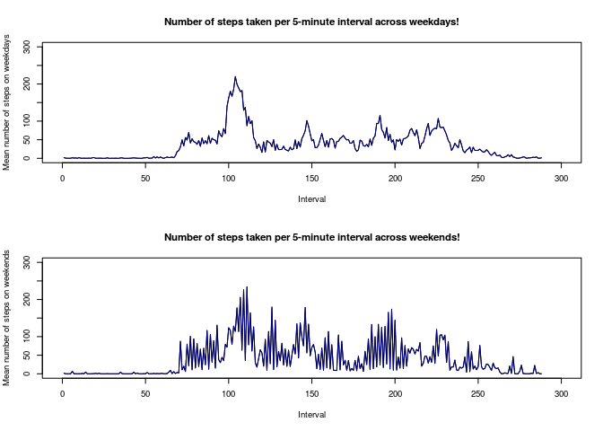

Load & Preprocess data
----------------------

Read csv file activity.csv in R , check it's summary and preprocess it.

    daFr <-read.csv("activity.csv")
    attach(daFr)
    summary(daFr)

    ##      steps                date          interval     
    ##  Min.   :  0.00   2012-10-01:  288   Min.   :   0.0  
    ##  1st Qu.:  0.00   2012-10-02:  288   1st Qu.: 588.8  
    ##  Median :  0.00   2012-10-03:  288   Median :1177.5  
    ##  Mean   : 37.38   2012-10-04:  288   Mean   :1177.5  
    ##  3rd Qu.: 12.00   2012-10-05:  288   3rd Qu.:1766.2  
    ##  Max.   :806.00   2012-10-06:  288   Max.   :2355.0  
    ##  NA's   :2304     (Other)   :15840

    daFr$date <- as.Date(daFr$date, "%Y-%m-%d")
    head(daFr)

    ##   steps       date interval
    ## 1    NA 2012-10-01        0
    ## 2    NA 2012-10-01        5
    ## 3    NA 2012-10-01       10
    ## 4    NA 2012-10-01       15
    ## 5    NA 2012-10-01       20
    ## 6    NA 2012-10-01       25

What is mean total number of steps taken per day?
-------------------------------------------------

-   Calculate the total number of steps taken per day
-   Make a histogram of the total number of steps taken each day
-   Calculate and report the mean and median of the total number of
    steps taken per day

<!-- -->

    totStepPerDay <- aggregate(list(steps = daFr$steps), list(date = factor(daFr$date)),sum)
    head(totStepPerDay)

    ##         date steps
    ## 1 2012-10-01    NA
    ## 2 2012-10-02   126
    ## 3 2012-10-03 11352
    ## 4 2012-10-04 12116
    ## 5 2012-10-05 13294
    ## 6 2012-10-06 15420

    hist(totStepPerDay$steps,ylim = c(0,30),xlab ="Total steps walked per day" ,
         main= "Total number of steps taken each day! ",  breaks = 10, col="Midnight blue") 

    meanStps <- aggregate(list(steps = daFr$steps), list(date = factor(daFr$date)), mean)

    medianStps <- aggregate( list(steps = daFr$steps), list(date = factor(daFr$date)), median)

    ts <- tapply(daFr$steps, daFr$date, sum)
    mean(ts, na.rm = TRUE)

    ## [1] 10766.19

    median(ts, na.rm = TRUE)

    ## [1] 10765

    head(meanStps)

    ##         date    steps
    ## 1 2012-10-01       NA
    ## 2 2012-10-02  0.43750
    ## 3 2012-10-03 39.41667
    ## 4 2012-10-04 42.06944
    ## 5 2012-10-05 46.15972
    ## 6 2012-10-06 53.54167

    head(medianStps)

    ##         date steps
    ## 1 2012-10-01    NA
    ## 2 2012-10-02     0
    ## 3 2012-10-03     0
    ## 4 2012-10-04     0
    ## 5 2012-10-05     0
    ## 6 2012-10-06     0

    plot(meanStps$steps ~ meanStps$date, type= "l", pch=10,xlab="Date" , ylab= "Mean num of steps" , main="Mean num of steps taken on each date!")
      lines(meanStps$steps, type="l", col="midnight blue")

What is the average daily activity pattern?
-------------------------------------------

-   Make a time series plot (i.e. type = "l") of the 5-minute
    interval (x-axis) and the average number of steps taken, averaged
    across all days (y-axis)
-   Which 5-minute interval, on average across all the days in the
    dataset, contains the maximum number of steps?

<!-- -->

    ms<-  tapply(daFr$steps, daFr$interval, mean, na.rm = TRUE)

    plot(row.names(ms), ms, type = "l", xlab = "Time Intervals (5-minute)", 
        ylab = "Mean number of steps taken each day!)", main = "Average steps taken at 5 min intervals",     col = "midnight blue")

    int_num <- which.max(ms)
    intervalWithMaxSteps <- names(int_num)
    intervalWithMaxSteps

    ## [1] "835"
    
    ### Conclusion:

-  The interval with maximum number of steps is "835 - 840"

Imputing missing values
-----------------------

Note that there are a number of days/intervals where there are missing
values (coded as NA). The presence of missing days may introduce bias
into some calculations or summaries of the data.

-   Make a histogram of the total number of steps taken each day and
    Calculate and report the mean and median total number of steps taken
    per day.

<!-- -->

    missingVals<- sum(is.na(daFr))
    indx_na <- which(is.na(daFr))
    imputedVals <- ms[as.character(daFr[indx_na, 3])]
    names(imputedVals) <- indx_na
    for (i in indx_na) {
        daFr$steps[i] = imputedVals[as.character(i)]
    }
    sum(is.na(daFr))

    ## [1] 0

    par(mfrow=c(1,1))
    totStepPerDayAfterImput <- aggregate(list(steps = daFr$steps), list(date = factor(daFr$date)),sum)
    head(totStepPerDayAfterImput )

    ##         date    steps
    ## 1 2012-10-01 10766.19
    ## 2 2012-10-02   126.00
    ## 3 2012-10-03 11352.00
    ## 4 2012-10-04 12116.00
    ## 5 2012-10-05 13294.00
    ## 6 2012-10-06 15420.00

    hist(totStepPerDayAfterImput$steps, ylim = c(0,30),xlab ="Total steps walked per day" ,
         main= "Total number of steps taken each day! ",  breaks = 10, col="Midnight blue") 

### Conclusion:

-   The total number of missing values in the dataset (i.e. the total
    number of rows with NAs)
    -   2304 missing values in the column "steps"
-   Devise a strategy for filling in all of the missing values in
    the dataset. The strategy does not need to be sophisticated. For
    example, you could use the mean/median for that day, or the mean for
    that 5-minute interval, etc.
    -   I imputed the NA values with the mean of steps.
-   Create a new dataset that is equal to the original dataset but with
    the missing data filled in.
    -   I updated the original dataframe daFr.
-   Do these values differ from the estimates from the first part of the
    assignment?
    -   No
-   What is the impact of imputing missing data on the estimates of the
    total daily number of steps?
    -   The mean of overall data distribution has increased in
        modified dataset.

<!-- -->

    daFr$day<- weekdays(as.POSIXct(daFr$date), abbreviate = T)
    weekendData<- subset(daFr, daFr[,4] == c("Sun", "Sat"))
    weekdayData<- subset(daFr, daFr[,4] != c("Sun", "Sat"))

    weekendSteps<- aggregate(steps ~ interval , data=weekendData, FUN=mean)
    weekdaySteps<- aggregate(steps ~ interval , data=weekdayData, FUN=mean)

    summary(weekendSteps)

    ##     interval          steps        
    ##  Min.   :   0.0   Min.   :  0.000  
    ##  1st Qu.: 588.8   1st Qu.:  1.126  
    ##  Median :1177.5   Median : 18.367  
    ##  Mean   :1177.5   Mean   : 38.884  
    ##  3rd Qu.:1766.2   3rd Qu.: 64.744  
    ##  Max.   :2355.0   Max.   :234.136

    summary(weekdaySteps)

    ##     interval          steps        
    ##  Min.   :   0.0   Min.   :  0.000  
    ##  1st Qu.: 588.8   1st Qu.:  2.057  
    ##  Median :1177.5   Median : 30.097  
    ##  Mean   :1177.5   Mean   : 37.180  
    ##  3rd Qu.:1766.2   3rd Qu.: 52.693  
    ##  Max.   :2355.0   Max.   :220.041

    par(mfrow=c(2,1))
    par(cex = 0.6)

    plot(weekdaySteps$steps, type= "l", xlim= c(0,300) ,ylim= c(0,300) ,xlab="Interval" , ylab= "Mean number of steps on weekdays" , main="Number of steps taken per 5-minute interval across weekdays!")
      lines(weekdaySteps$steps, type="l", col="Navy blue")

    plot(weekendSteps$steps, type= "l", xlim= c(0,300), ylim= c(0,300), xlab="Interval" , ylab= "Mean number of steps on weekends" , main="Number of steps taken per 5-minute interval across weekends!")
      lines(weekendSteps$steps, type="l", col="Navy blue")

### Conclusion:

-   We can see from both the graphs above that activity levels on
    weekends are much higher and frequent as compared to weekdays hence
    the number of steps is higher on weekends.
